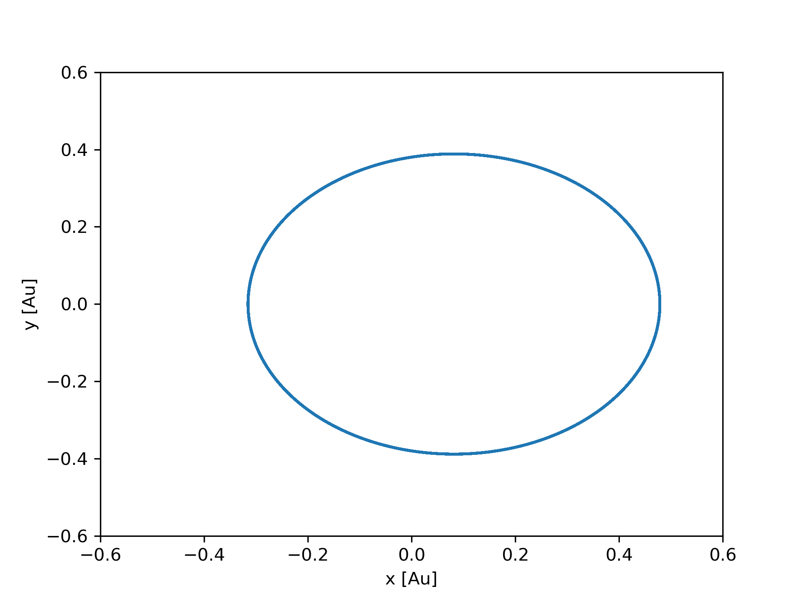
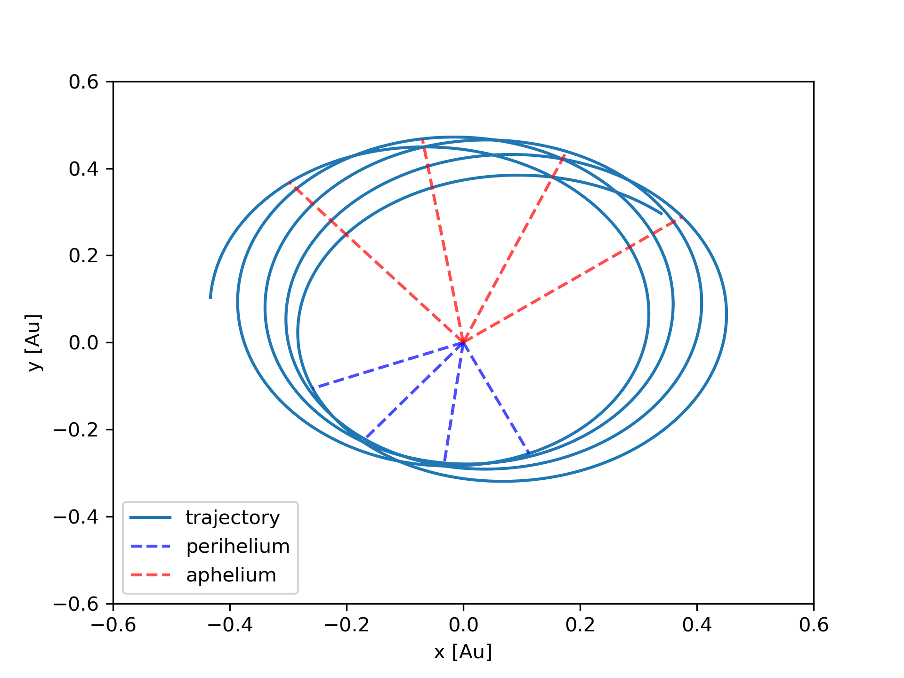
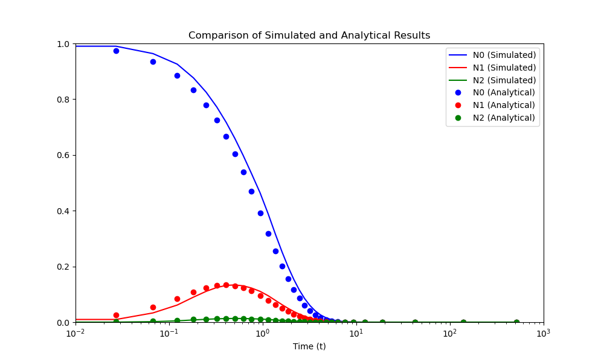
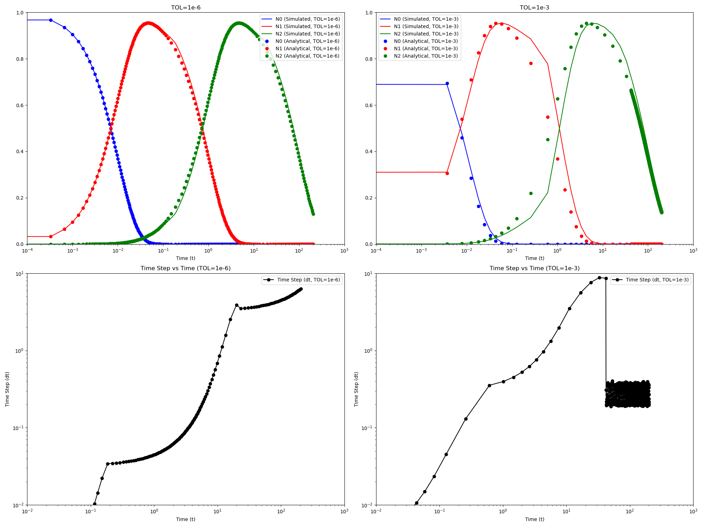

# Computational Physics Simulations

This repository is a collection of my personal projects and simulations exploring various concepts in computational physics. I'm using this space to apply numerical methods to solve interesting physics problems.

---

## Projects

### 1. Projectile Launch Simulation

This project simulates the trajectory of a projectile launched at a given velocity and angle. The simulation is implemented in C++ and uses the Euler method to solve the equations of motion. Python scripts are used for data visualization.

The simulation explores several scenarios:

*   **No Air Drag:** Analyzes the trajectory without air resistance and examines the global error of the numerical solution compared to the analytical solution for different time steps (`delta_t`).
*   **Constant Air Drag:** Investigates the effect of a constant drag force (D) on the projectile's trajectory.
*   **Variable Air Drag:** Simulates the trajectory with air density changing with altitude, providing a more realistic model.
*   **Optimal Angle Analysis:** Determines the launch angle that results in the maximum range for different drag coefficients.

#### Technologies Used

*   **Simulation:** C++
*   **Data Analysis & Plotting:** Python with `matplotlib`, `numpy`, and `pandas`.

#### Visualizations

**Trajectories with No Drag vs. Error Analysis**

**Trajectories with Varying Drag Coefficients**

**Range vs. Launch Angle for Different Drag Coefficients**

**Trajectories with Altitude-Dependent Drag**

---

### 2. Resonance in a One-Dimensional Harmonic Oscillator

This project investigates the phenomenon of resonance in a one-dimensional harmonic oscillator. The simulation is built in C++ and uses the 4th order Runge-Kutta (RK4) method to solve the differential equation of a damped, driven harmonic oscillator.

The simulation covers:
*   **Damped Oscillations:** Analyzes the system's behavior with varying damping coefficients.
*   **Driven Oscillations:** Studies the steady-state amplitude as a function of the driving frequency to identify the resonance frequency.
*   **Resonance Curves:** Generates response curves for different levels of damping, showing how damping affects the sharpness of the resonance peak.

#### Technologies Used

*   **Simulation:** C++ (using RK4 for numerical integration)
*   **Data Analysis & Plotting:** Python with `matplotlib` and `numpy`.

#### Visualizations

**Oscillator's Response for Different Damping Factors**

**Resonance Curve - Amplitude vs. Driving Frequency**

---

### 3. Symplectic Integrators and the Precession of Mercury's Orbit

This project simulates the orbit of Mercury around the Sun, with a focus on the precession of its perihelion. The simulation is implemented in C++ using a symplectic integrator, which is particularly well-suited for long-term orbital mechanics simulations. The model incorporates a parameter (`alpha`) to simulate the effects of General Relativity, which are responsible for the observed precession.

The simulation explores:
*   **Orbital Trajectory:** Simulates Mercury's orbit over long periods to observe the precession.
*   **Perihelion and Aphelion Analysis:** Identifies and analyzes the points of closest (perihelion) and farthest (aphelion) approach to the Sun.
*   **Precession Rate:** Studies the rate of precession for different values of the relativistic correction parameter `alpha`.

#### Technologies Used

*   **Simulation:** C++ (using a symplectic integrator)
*   **Data Analysis & Plotting:** Python with `matplotlib` and `numpy`.

#### Visualizations

**Mercury's Orbit Over 100 Periods**

**Precession of Mercury's Perihelion**

---

### 4. Simulation of Radioactive Decay

This project simulates the radioactive decay of a three-isotope chain using a C++ program and visualizes the results with Python. The simulation uses an adaptive step-size control algorithm based on the trapezoid method to ensure accuracy and efficiency.

The simulation covers:
*   **Radioactive Decay Chain:** Models the decay of a parent isotope into a daughter isotope, and subsequently into a granddaughter isotope.
*   **Adaptive Step-Size:** Implements an adaptive algorithm to adjust the step size of the numerical integration, ensuring the solution remains within a specified tolerance.
*   **Analytical Comparison:** Compares the numerical results with the analytical solution to validate the accuracy of the simulation.

#### Technologies Used

*   **Simulation:** C++ (using an adaptive trapezoid method for numerical integration)
*   **Data Analysis & Plotting:** Python with `matplotlib` and `numpy`.

#### Visualizations

**Radioactive Decay of a Three-Isotope Chain**

**Error Analysis of the Adaptive Step-Size Method**

---

*I'll be adding more simulations and projects as I explore new topics.*