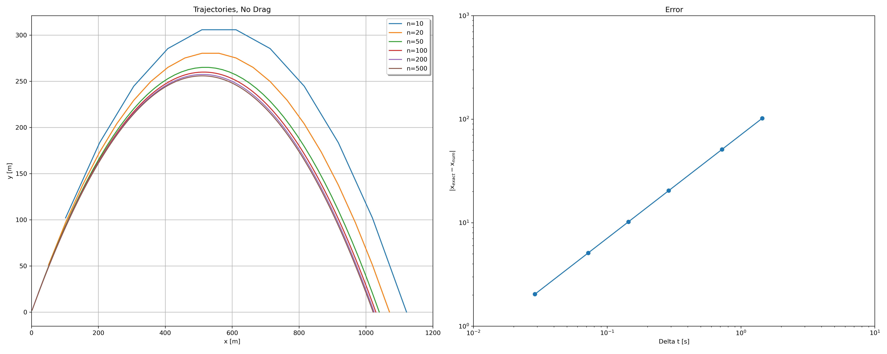
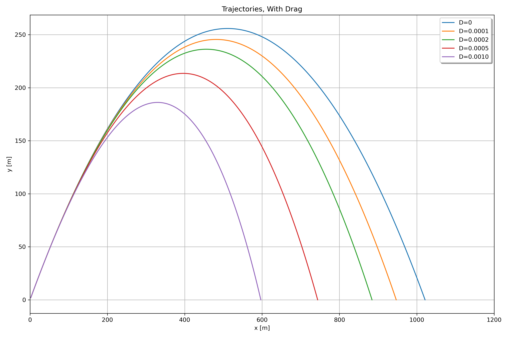
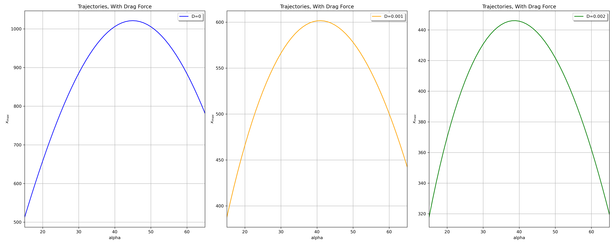
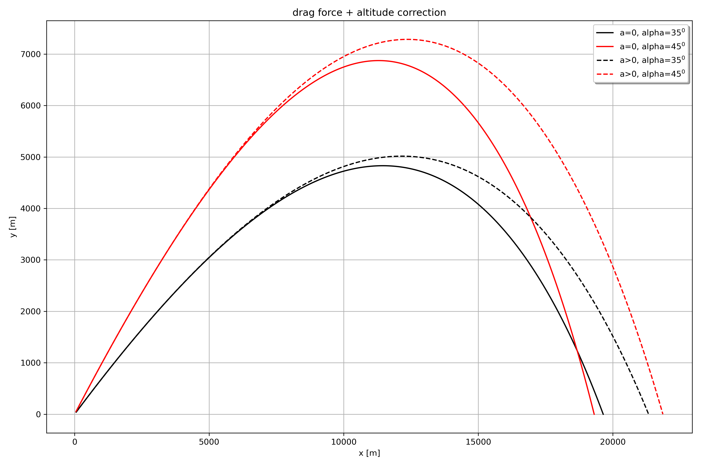
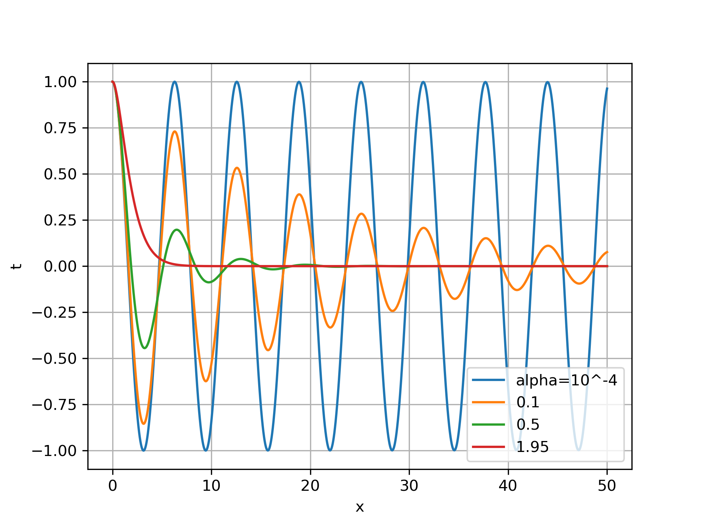
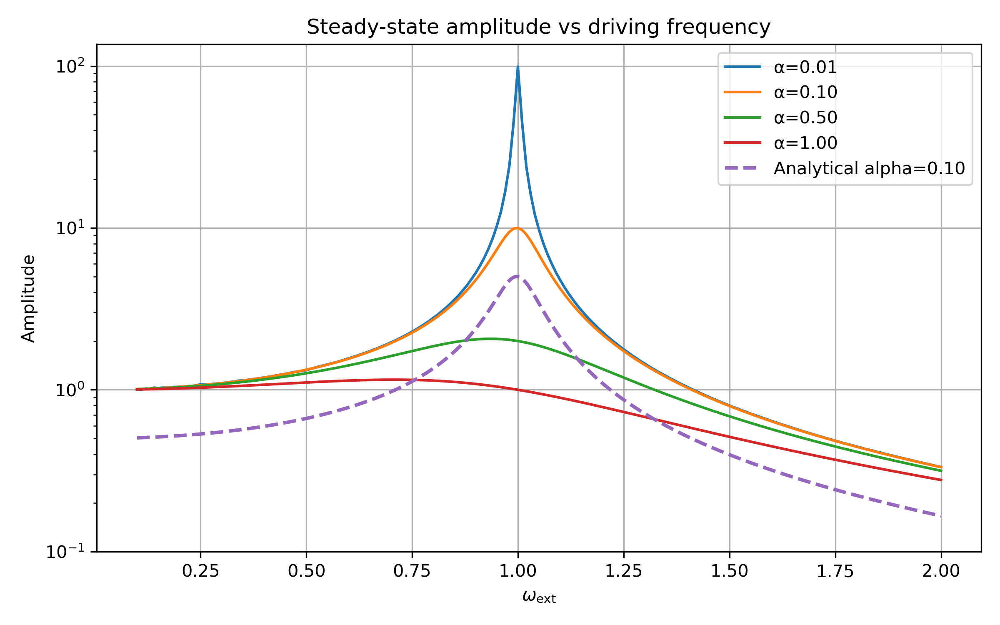

# Computational Physics Simulations

This repository is a collection of my personal projects and simulations exploring various concepts in computational physics. I'm using this space to apply numerical methods to solve interesting physics problems.

---

## Projects

### 1. Projectile Launch Simulation

This project simulates the trajectory of a projectile launched at a given velocity and angle. The simulation is implemented in C++ and uses the Euler method to solve the equations of motion. Python scripts are used for data visualization.

The simulation explores several scenarios:

*   **No Air Drag:** Analyzes the trajectory without air resistance and examines the global error of the numerical solution compared to the analytical solution for different time steps (`delta_t`).
*   **Constant Air Drag:** Investigates the effect of a constant drag force (D) on the projectile's trajectory.
*   **Variable Air Drag:** Simulates the trajectory with air density changing with altitude, providing a more realistic model.
*   **Optimal Angle Analysis:** Determines the launch angle that results in the maximum range for different drag coefficients.

#### Technologies Used

*   **Simulation:** C++
*   **Data Analysis & Plotting:** Python with `matplotlib`, `numpy`, and `pandas`.

#### Visualizations

**Trajectories with No Drag vs. Error Analysis**

**Trajectories with Varying Drag Coefficients**

**Range vs. Launch Angle for Different Drag Coefficients**

**Trajectories with Altitude-Dependent Drag**

---

### 2. Resonance in a One-Dimensional Harmonic Oscillator

This project investigates the phenomenon of resonance in a one-dimensional harmonic oscillator. The simulation is built in C++ and uses the 4th order Runge-Kutta (RK4) method to solve the differential equation of a damped, driven harmonic oscillator.

The simulation covers:
*   **Damped Oscillations:** Analyzes the system's behavior with varying damping coefficients.
*   **Driven Oscillations:** Studies the steady-state amplitude as a function of the driving frequency to identify the resonance frequency.
*   **Resonance Curves:** Generates response curves for different levels of damping, showing how damping affects the sharpness of the resonance peak.

#### Technologies Used

*   **Simulation:** C++ (using RK4 for numerical integration)
*   **Data Analysis & Plotting:** Python with `matplotlib` and `numpy`.

#### Visualizations

**Oscillator's Response for Different Damping Factors**

**Resonance Curve - Amplitude vs. Driving Frequency**

---

*I'll be adding more simulations and projects as I explore new topics.*